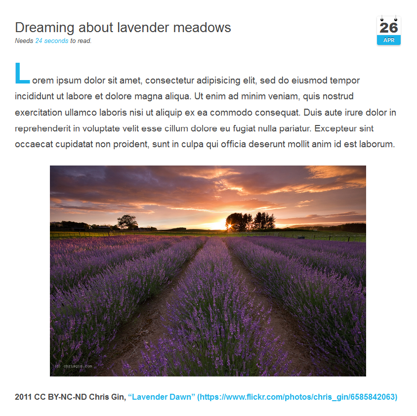

# [][project]

[][project] [][issues] [](LICENSE "License") <span style="float:right;">[][flattr] [][paypal]</span>

> This plugin embeds several media sites (e.g. YouTube, Vimeo, Soundcloud) by only providing the URL to the medium.

##### Table of Contents:

* [About](#about)
* [Installation and Updates](#installation-and-updates)
* [Usage](#usage)
* [Contributing](#contributing)
* [Licencse](#license)

## About

Grav MediaEmbed plugin is the official successor of [Grav VideoEmbed plugin](https://github.com/sommerregen/grav-plugin-videoembed/), allows to embed several media sites by only providing the URL to the medium and supports lazy loading techniques for videos and other media. Currently it supports

- YouTube
- Vimeo
- DailyMotion
- SoundCloud
- Spotify
- Flickr
- Imgur
- Instagram
- GitHub

but more services are coming soon! In principle it supports any service, which provides the [oEmbed format](http://www.oembed.com/). Media are embedded using the Markdown syntax for images (``), e.g. the below screenshot was created with the following code:

```

```



### The Roadmap

Grav MediaEmbed plugin is neat and a powerful tool to embed other media types. However at the moment only a few services are supported. Further the configuration for the services may differ under certain circumstances; some may be more configurable than others. In future releases I intend to implement:

 - [ ] a unified interface for accessing [OEmbed](http://oembed.com "An overview about OEmbed services") services
 - [ ] a cache mechanism for requests, data and images
 - [ ] support more than 200+ OEmbed services
 - [ ] and a more powerful API

If you have any ideas to extend the list, then please don't hesitate to open an issue and spread your idea with the community!

So far I'm happy that Grav MediaEmbed plugin becomes one of the most popular a d used plugins in a few days. Thank you! I try to give my best to provide you a fast, easy to use and extensible plugin. I have already spent a lot of time and will spend a lot of time even more. The plan is to extend Grav MediaEmbed plugin even more to embed arbitrary websites and embed media as cards (e.g. Wordpress, Twitter, Facebook, GitHub). This will however mean a many hour work and thus I plan to support such features in a paid version of Grav MediaEmbed plugin called "MediaEmbed Pro", which will coming soon. From then on, Grav MediaEmbed plugin will come in two flavors: a free version supporting all OEmbed services and a paid version with better embedding support of media and enabling the use of embed media cards.

## Installation and Updates

Installing or updating the `MediaEmbed` plugin can be done in one of two ways. Using the GPM (Grav Package Manager) installation update method (i.e. `bin/gpm install mediaembed`) or manual install by downloading [this plugin](https://github.com/sommerregen/grav-plugin-mediaembed) and extracting all plugin files to

    user/plugins/mediaembed

For more informations, please check the [Installation and update guide](docs/INSTALL.md).

## Usage

The `MediaEmbed` plugin comes with some sensible default configuration, that are pretty self explanatory:

### Config Defaults

```yaml
# Global plugin configurations

enabled: true                # Set to false to disable this plugin completely
built_in_css: true           # Use built-in CSS of the plugin
built_in_js: true            # Use built-in JS of the plugin

# Default options for MediaEmbed configuration.

# -- Media --
media:
  width: 640                 # Default media width
  height: 390                # Default media height including controls
  adjust: true               # Adjust media or keep default dimensions?

  preview: true              # Show or hide media preview
  responsive: false          # Allow media to be responsive
  protocol: "http://"        # Default protocol for remote media resources

services:
	<ServiceName>:
    enabled: true            # Set to false to disable this service completely
    type: <Type>             # Type of the media service

    # URL of media service used for embedding
    url: "www.domain.com/embed/{:id}"

    # Canonical URL of media service (used in endpoint calls)
    canonical: "http://www.domain.com/{:id}"

    # Endpoint to grab media informations
    endpoint: "http://www.domain.com/oembed?url={:canonical}&format=json"

    # Regex filters ("~REGEX~i") to grab media id
    schemes:
      - "domain.com/*"

    # Custom service-related media option overrides
    params:
      <Param>: <Value>
```

If you need to change any value, then the best process is to copy the [mediaembed.yaml](mediaembed.yaml) file into your `users/config/plugins/` folder (create it if it doesn't exist), and then modify there. This will override the default settings.

## Contributing

You can contribute at any time! Before opening any issue, please search for existing issues and review the [guidelines for contributing](docs/CONTRIBUTING.md).

After that please note:

* If you find a bug, would like to make a feature request or suggest an improvement, [please open a new issue][issues]. If you have any interesting ideas for additions to the syntax please do suggest them as well!
* Feature requests are more likely to get attention if you include a clearly described use case.
* If you wish to submit a pull request, please make again sure that your request match the [guidelines for contributing](docs/CONTRIBUTING.md) and that you keep track of adding unit tests for any new or changed functionality.

### Support and donations

If you like my project, feel free to support me via [][flattr] or by sending me some bitcoins to [**1HQdy5aBzNKNvqspiLvcmzigCq7doGfLM4**][bitcoin].

Thanks!

## License

Copyright (c) 2015 [Benjamin Regler][github]. See also the list of [contributors] who participated in this project.

[Dual-licensed](LICENSE) for use under the terms of the [MIT][mit-license] or [GPLv3][gpl-license] licenses.

![GNU license - Some rights reserved][gnu]

[github]: https://github.com/sommerregen/ "GitHub account from Benjamin Regler"
[gpl-license]: http://opensource.org/licenses/GPL-3.0 "GPLv3 license"
[mit-license]: http://www.opensource.org/licenses/mit-license.php "MIT license"

[flattr]: https://flattr.com/submit/auto?user_id=Sommerregen&url=https://github.com/sommerregen/grav-plugin-mediaembed "Flatter my GitHub project"
[paypal]: https://www.paypal.com/cgi-bin/webscr?cmd=_s-xclick&hosted_button_id=SYFNP82USG3RN "Donate for my GitHub project using PayPal"
[bitcoin]: bitcoin:1HQdy5aBzNKNvqspiLvcmzigCq7doGfLM4?label=GitHub%20project "Donate for my GitHub project using BitCoin"
[gnu]: https://upload.wikimedia.org/wikipedia/commons/thumb/3/33/License_icon-gpl-88x31.svg/88px-License_icon-gpl-88x31.svg.png "GNU license - Some rights reserved"

[project]: https://github.com/sommerregen/grav-plugin-mediaembed
[issues]: https://github.com/sommerregen/grav-plugin-mediaembed/issues "GitHub Issues for Grav MediaEmbed Plugin"
[contributors]: https://github.com/sommerregen/grav-plugin-mediaembed/graphs/contributors "List of contributors of the project"
